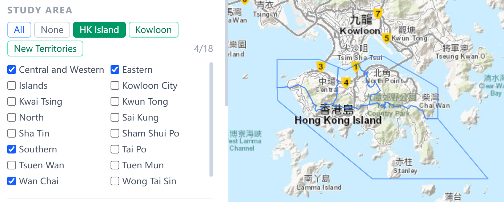
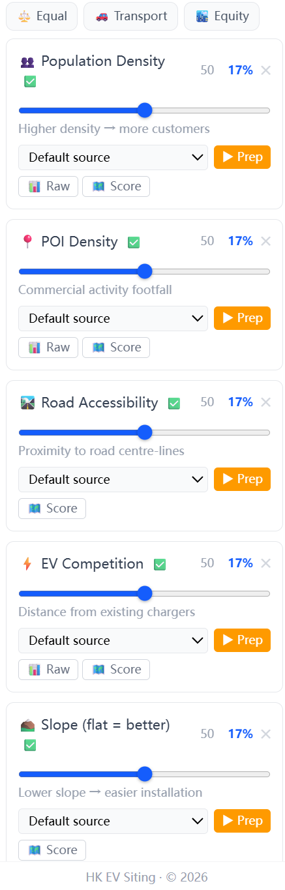
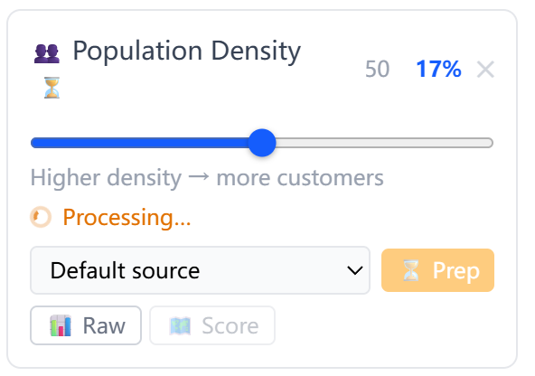
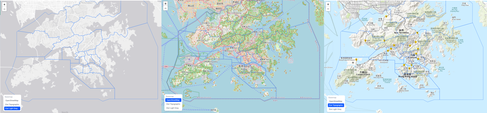

# HK EV Charging Station Site Selection

A spatial multi-criteria suitability tool for identifying optimal EV charging station locations across Hong Kong. Built with ArcPy (ArcGIS Pro), FastAPI, and React + Leaflet.

---

## Screenshots

**Main interface — sidebar + map overview**


**Study area selection — Kowloon region preset applied, district boundaries on map**



**Factor cards — status indicators and individual Prep buttons**



**Preprocessing in progress — Population Density factor running**



**Score raster overlay — Land Use factor score visualised on map**


**Raw layer overlay — existing EV charger locations as point data**


**Analysis results — top candidate sites ranked on map**


**Basemap switching — Esri Light Gray / OpenStreetMap / Esri Topographic**



---

## Features

### Study Area Selection
Choose any combination of Hong Kong's 18 districts as the analysis boundary. One-click presets for the three major regions — **HK Island**, **Kowloon**, and **New Territories** — let you quickly scope the analysis. The selected boundary is drawn as an overlay on the map and propagates to all analysis steps.

### Per-Factor Data Preprocessing
Six suitability factors can be preprocessed independently. Each factor card shows its current status (✅ ready / ⏳ processing / ❓ not yet run) and has its own **Prep** button and data-source selector.

| Factor | Source data | Scoring logic |
|---|---|---|
| Road Accessibility | Road centreline shapefile | DistanceAccumulation with slope cost surface — closer and flatter routes score higher |
| Population Density | LSUG census polygons | Persons / km² → normalised; higher density scores higher |
| EV Competition | Existing charger points | Euclidean distance from existing chargers — farther scores higher (less competition) |
| Land Use | BLU land-use raster | Reclassified per land-use codes; commercial / institutional highest; natural areas excluded |
| Slope Suitability | DTM-derived slope raster | Inverted — flatter terrain scores higher |
| POI Density | GeoCom POI CSV | TYPE-weighted Kernel Density (800 m radius) — commercial activity intensity |

Preprocessed rasters are cached in `backend/data/preprocessed/`. Re-run a factor only when the underlying data changes.

### Weight Configuration
Each factor's contribution is controlled by a 0–100 weight slider. The percentage shown next to each slider reflects that factor's share of the total. Three one-click **scenario presets** are provided:

| Preset | Emphasis |
|---|---|
| ⚖️ Equal | All six factors contribute equally (~17% each) |
| 🚗 Transport | Road accessibility + POI proximity dominant (30% + 38%) |
| 🏙️ Equity | Population coverage + EV competition gap dominant (25% + 30%) |

### Analysis & Results
Click **Run Analysis** to compute the weighted suitability surface for the selected study area, apply the land-use mask, and extract the top candidate sites with a minimum 300 m spacing. Results appear immediately as numbered markers on the map. Click any marker to see its rank, score, coordinates, and an embedded **Google Street View** thumbnail. Results are saved with a timestamp and accessible from the **Result History** dropdown.

### Layer Visualisation
Each factor card has two layer toggle buttons:
- **📊 Raw** — shows the original input data as point/polygon features on the map
- **🗺 Score** — shows the normalised score raster as a colour-coded overlay (green = low suitability → red = high suitability)

The **Show suitability heatmap** option in the Run Analysis section renders the final composite score raster after analysis.

### Basemap Switching
Three base map styles are available from the bottom-left control: OpenStreetMap, Esri Topographic, and Esri Light Gray.

---

## Project Structure

```
ev-siteselect/
├── backend/
│   ├── arcpy_engine.py     ← all ArcPy geoprocessing (preprocessing, analysis, export)
│   ├── main.py             ← FastAPI app (routes, background tasks, Street View proxy)
│   ├── requirements.txt
│   ├── start.ps1           ← convenience launch script
│   └── data/
│       ├── preprocessed/   ← auto-generated factor rasters (git-ignored)
│       └── results/        ← timestamped GeoJSON results (git-ignored)
├── frontend/
│   ├── src/
│   │   ├── App.jsx
│   │   ├── components/     ← Sidebar, MapView, FactorModule, DistrictSelector, …
│   │   ├── hooks/          ← useFactors (weight/status state)
│   │   └── utils/          ← api.js, constants.js
│   ├── index.html
│   └── vite.config.js      ← /api proxy → localhost:8000
├── raw_data/               ← source shapefiles, rasters, CSVs (not modified)
├── docs/
│   └── prd.md
└── .env                    ← API keys (see Setup)
```

---

## Requirements

| Requirement | Details |
|---|---|
| ArcGIS Pro | 3.x with Spatial Analyst extension licensed |
| Python | ArcGIS Pro conda environment (`arcgispro-py3-clone` or equivalent) |
| Python packages | `fastapi`, `uvicorn`, `httpx`, `python-dotenv` |
| Node.js | 18+ (for frontend dev server / build) |
| Browser | Any modern browser (Chrome / Edge recommended) |

---

## Setup & Launch

### 1. Configure environment variables

Create a `.env` file in the repo root (a template is already present):

```
GOOGLEMAP_API_KEY=your_key_here
```

The Google Maps Static API key is used for Street View thumbnails in site popups. The app functions fully without it — popups simply omit the thumbnail.

### 2. Activate the ArcGIS Pro Python environment

```powershell
conda activate arcgispro-py3-clone
```

### 3. Install Python dependencies

```powershell
cd backend
pip install -r requirements.txt
```

### 4. Start the backend

```powershell
uvicorn main:app --port 8000 --reload
```

Or use the convenience script:

```powershell
.\start.ps1
```

### 5. Start the frontend development server

```powershell
cd frontend
npm install
npm run dev
```

Open **http://localhost:5173** in your browser (API calls are proxied to port 8000).

> **Production build**: `npm run build` in `frontend/`. The compiled `dist/` is automatically served by FastAPI at `http://localhost:8000/app`.

---

## Usage

### Step 1 — Select a study area
Use the **Study Area** checkboxes or region preset buttons to choose which districts to analyse. The blue boundary outlines on the map update immediately.

### Step 2 — Preprocess factors (first run only, ~15–40 min total)
Click **▶ Prep** on each factor card. The Road Accessibility factor is the slowest (~20–30 min) due to the DistanceAccumulation algorithm. A spinning indicator shows which factors are actively processing; ✅ appears when complete. Preprocessed outputs are cached — skip this step on subsequent runs unless the raw data has changed.

### Step 3 — Set weights
Adjust the sliders or click a scenario preset. The percentage next to each slider shows that factor's normalised contribution.

### Step 4 — Run Analysis
Set the number of candidate sites (1–20) and click **Run Analysis**. Results appear within a few seconds. Click any marker to see site details and Street View. Use **Result History** to reload a previous run.

---

## API Reference

| Method | Route | Description |
|---|---|---|
| `GET` | `/api/health` | Health check |
| `GET` | `/api/status` | Preprocessing status for all factor rasters |
| `GET` | `/api/raw-sources` | Available raw data files, grouped by type |
| `GET` | `/api/districts` | List of 18 district names |
| `GET` | `/api/districts/geojson` | District boundaries as WGS84 GeoJSON |
| `POST` | `/api/preprocess` | Run full preprocessing pipeline (background) |
| `POST` | `/api/preprocess/{factor_key}` | Preprocess a single factor (background) |
| `POST` | `/api/siting` | Run suitability analysis, return ranked GeoJSON sites |
| `GET` | `/api/layer/raster/{name}` | Export a score raster as base64 PNG + WGS84 bounds |
| `GET` | `/api/layer/vector/{name}` | Export a raw vector layer as WGS84 GeoJSON |
| `GET` | `/api/results` | List timestamped result files |
| `GET` | `/api/results/{filename}` | Load a specific result GeoJSON |
| `GET` | `/api/streetview` | Server-side Street View image proxy (hides API key) |

### POST `/api/siting` — request body

```json
{
  "weights": {
    "population": 17,
    "poi": 17,
    "road_accessibility": 17,
    "ev_competition": 17,
    "slope": 16,
    "landuse": 16
  },
  "num_sites": 5,
  "study_area": ["Central and Western District", "Wan Chai District"]
}
```

`study_area` is optional — omit or pass an empty array to use all 18 districts. Weights are normalised automatically and do not need to sum to any particular value.

### POST `/api/siting` — response (GeoJSON)

```json
{
  "type": "FeatureCollection",
  "features": [
    {
      "type": "Feature",
      "geometry": { "type": "Point", "coordinates": [114.1694, 22.3193] },
      "properties": { "score": 8.421, "rank": 1 }
    }
  ]
}
```
