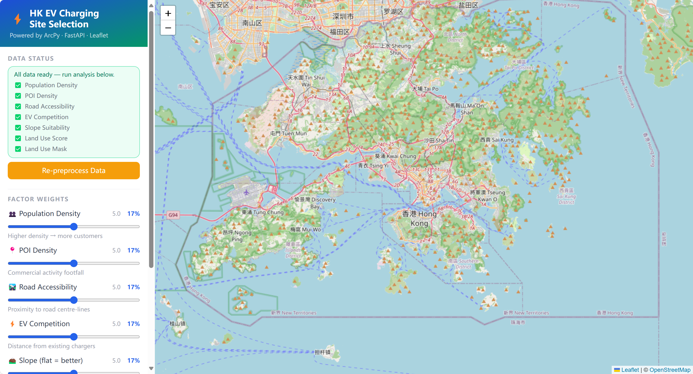
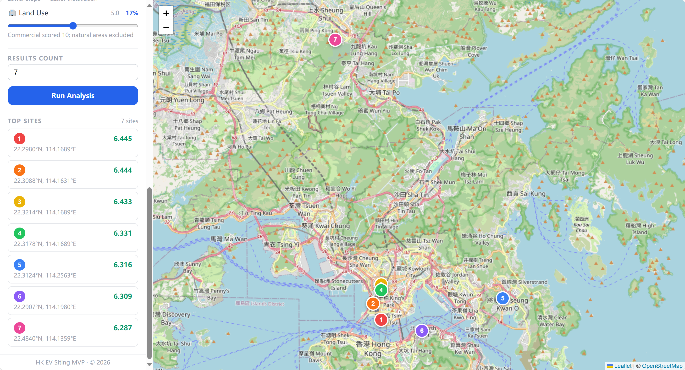

# HK EV Charging Station Site Selection — MVP

A spatial multi-criteria suitability tool for identifying optimal EV charging station locations across Hong Kong. Built with ArcPy (ArcGIS Pro), FastAPI, and Leaflet.

---

## Screenshots

**Data-ready state — all factors preprocessed, ready to run analysis**



**Analysis results — top candidate sites ranked on the map**



---

## Project Structure

```
ev_siting_mvp/
├── data/
│   └── preprocessed/       ← auto-generated; cached factor rasters (created on first preprocess)
├── backend/
│   ├── arcpy_engine.py     ← all ArcPy geoprocessing logic
│   ├── main.py             ← FastAPI app (routes, CORS, background tasks)
│   ├── requirements.txt    ← fastapi, uvicorn
│   └── start.ps1           ← convenience launch script
└── frontend/
    ├── index.html          ← main UI (Tailwind CSS + Leaflet via CDN)
    ├── app.js              ← map, API calls, UI state
    └── style.css           ← overrides
```

Raw data lives in `../raw_data/` and is never modified.

---

## Requirements

| Requirement | Details |
|---|---|
| ArcGIS Pro | 3.x with Spatial Analyst extension licensed |
| Python | ArcGIS Pro conda environment (`arcgispro-py3-clone` or equivalent) |
| Python packages | `fastapi`, `uvicorn` (see `requirements.txt`) |
| Browser | Any modern browser (Chrome / Edge recommended) |

---

## Setup & Launch

### 1. Activate the ArcGIS Pro Python environment

```powershell
conda activate arcgispro-py3-clone
```

### 2. Install Python dependencies

```powershell
cd ev_siting_mvp\backend
pip install -r requirements.txt
```

### 3. Start the backend server

```powershell
uvicorn main:app --port 8000 --reload
```

Or use the convenience script:

```powershell
.\start.ps1
```

### 4. Open the frontend

Navigate to **http://localhost:8000/app** in your browser.

> Alternatively, open `frontend/index.html` directly as a local file — all API calls target `http://localhost:8000` regardless.

---

## Usage

### Step 1 — Preprocess data (one-time, ~15–40 min)

Click **Preprocess Data** in the sidebar. The backend converts all raw datasets into normalised score rasters (1–10 scale) and saves them to `data/preprocessed/`. The **Data Status** panel shows a live checklist of the 7 factor rasters being built:

| Factor raster | Source data | Logic |
|---|---|---|
| Population Density | `LSUG_21C_converted.shp` (`t_pop` field) | persons / km² → normalised high = good |
| POI Density | `GeoCom4.1_202510.csv` (EASTING / NORTHING) | Kernel Density 500 m bandwidth → normalised |
| Road Accessibility | `Transportation_TNM_*_CENTERLINE_*.shp` | Euclidean distance → inverted (closer = better) |
| EV Competition | `download_20260401_1622_converted.shp` | Euclidean distance → farther from existing chargers = better |
| Slope Suitability | `slope.tif` (derived from DTM) | Inverted (flatter = better) |
| Land Use Score | `BLU.tif` | Reclassified per `docs/landuse_code.txt`; commercial = 10, natural/water = excluded |
| Land Use Mask | `BLU.tif` | Binary: 1 = buildable, 0 = restricted (woodland, water, etc.) |

Once all 7 items show ✅ the **Run Analysis** button becomes active. Preprocessed rasters are cached — you only need to repeat this step if the raw data changes.

### Step 2 — Adjust factor weights

Use the six sliders to set the relative importance of each factor (0–10). The displayed percentage next to each slider shows the normalised weight after all six values are summed to 1.0.

| Slider | What it favours |
|---|---|
| Population Density | Areas with more residents / potential customers |
| POI Density | Areas with high commercial activity |
| Road Accessibility | Sites close to road centre-lines |
| EV Competition | Sites away from existing public chargers |
| Slope | Flat terrain (easier installation) |
| Land Use | Commercial / institutional land; excludes natural areas |

### Step 3 — Set result count

Enter the number of candidate sites to return (1–20) in the **Results Count** field.

### Step 4 — Run Analysis

Click **Run Analysis**. The backend:

1. Loads all 7 preprocessed rasters.
2. Computes a weighted sum using the submitted weights.
3. Applies the land-use mask (restricts to buildable land).
4. Resamples to 200 m resolution for efficient extraction.
5. Extracts the top cells (top 5% of score range).
6. Applies a **300 m minimum spacing** between selected sites to avoid clustering.
7. Projects results from EPSG:2326 (HK 1980 Grid) to WGS84 and returns GeoJSON.

Results appear as numbered markers on the map. Click any marker for its rank and suitability score. The **Top Sites** list in the sidebar lets you jump directly to any site.

---

## API Reference

The backend exposes three endpoints:

| Method | Route | Description |
|---|---|---|
| `GET` | `/api/health` | Health check |
| `GET` | `/api/status` | Returns preprocessing status for each factor raster |
| `POST` | `/api/preprocess` | Starts the preprocessing pipeline in the background |
| `POST` | `/api/siting` | Runs the suitability model and returns GeoJSON results |

### POST `/api/siting` — request body

```json
{
  "weights": {
    "population": 0.2,
    "poi": 0.2,
    "road_accessibility": 0.2,
    "ev_competition": 0.2,
    "slope": 0.1,
    "landuse": 0.1
  },
  "num_sites": 5
}
```

Weights do not need to sum to 1 — the backend normalises them automatically.

### POST `/api/siting` — response (GeoJSON)

```json
{
  "type": "FeatureCollection",
  "features": [
    {
      "type": "Feature",
      "geometry": { "type": "Point", "coordinates": [114.1694, 22.3193] },
      "properties": { "score": 8.421, "rank": 1 }
    }
  ]
}
```
